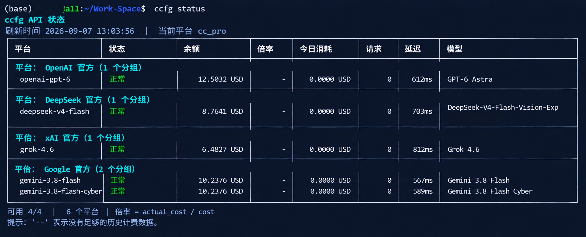

# ccfg-monitor

[](https://github.com/Michael8023/ccfg-monitor)
[](https://github.com/Michael8023/ccfg-monitor)
[](https://www.python.org/)

`ccfg` 是本地 Codex 配置（`~/.codex`）的**多平台/多分组管理工具**：一键查看所有 API 平台的余额、用量与可用模型，测试模型连通性，并在不同供应商、不同 API key 分组之间**手动原子切换**。

主要是平时在使用codex中转站过程中有些渠道不太稳定需要切换节点，所以做了一键切换api的小工具，现在主要用作仪表盘监控和测试接口功能。
>
>注意切换api后**重启vscode**生效，快捷键：按下 Ctrl + Shift + P (Windows/Linux) 或 Cmd + Shift + P (Mac) 打开命令面板。操作：输入 Reload Window 并选中执行，当前窗口>就会立即重新加载。甚至可以直接用快捷键 Ctrl + R (Windows/Linux) 或 Cmd + R (Mac) 来快速触发这个命令
>
>如果有任何不会用或者不清楚的功能：请先**使用AI解答**。
---

## 功能

- **余额与用量总览**：`ccfg status` 一次刷新全部平台的余额、今日消耗、请求数、延迟与可用模型
- **平台自动分组**：相同 `base_url` 的分组归为同一平台（例如多个分组都指向 `api.deepseek.com`，即同属 DeepSeek 平台），仅 API key 不同
- **余额回退链**：`/v1/usage` 不可用时，自动回退到 OpenAI dashboard billing 接口（`subscription` + `usage`）计算剩余额度
- **连通性测试**：`ccfg test` 实测文本/图像模型生成，文本直接打印、图像保存为本地文件
- **原子切换**：切换分组时先写临时文件并校验（JSON/TOML），成功后整体替换；中断不残留半成品配置，并保留活动配置的 `plugins` / `mcp_servers` 字段
- **分组增删**：`ccfg add` / `ccfg remove` 管理分组；删除活动分组自动切换，避免留下悬空配置
- **自检与清理**：`ccfg doctor` 诊断配置、权限、接口可达性；`ccfg cleanup` 清理可能含密钥的残留临时文件
- **安全**：认证文件 600 权限，密钥仅用于 `Authorization` 请求头，不写入插件状态、不包含在命令输出中

## 使用场景

- **多供应商额度巡检**：手上有多个 API 平台/中转站、多把 key，每天跑一次 `ccfg status` 就知道谁快没钱了
- **一键换供应商/换 key**：某个平台 401/欠费时，`ccfg use <分组>` 秒切到备用的分组，不用手改配置文件
- **同平台多 key 分组管理**：同一中转站办了普通/进阶/福利套餐（如 `cc_pro` / `cc_standard` / `cc_welfare`），用 `ccfg add` 分组建好、按需切换
- **模型可用性排查**：怀疑某平台模型列表或生成接口有问题时，`ccfg models` / `ccfg test` 直接验证
- **Codex 日常换模型**：`ccfg model <模型>` 直接改活动配置的模型，配合 Codex CLI 使用

## 推荐的中转站

以下是我自用的大模型 API 中转站（均为第三方服务，**非本人运营，仅作个人推荐**；通过推荐链接注册可以支持一下作者）：

- 🚀 **[aicyy.xyz](https://aicyy.xyz/register?aff=GUEJU9C6W289)** — 大模型 API 中转平台，聚合多家主流模型，注册即用
- ⚡ **[XTokenMirror](https://www.xtokenmirror.com/register?aff=PSY4ZUM49X8T)** — 大模型 API 中转服务，接入便捷、按量计费

> 💡 拿到中转站的 `base_url` 和 API key 后，直接用 `ccfg add <分组> --base-url <URL>` 加入管理，即可用 `ccfg status` 监控额度、`ccfg use` 一键切换。

## 介绍

### 它是什么

`ccfg` 是一个 bash + Python3 的小工具，管理 **Codex 的活动配置文件**：`~/.codex/auth.json`（凭据）与 `~/.codex/config.toml`（模型/供应商配置）。它的核心概念是**分组（profile）**：

- 每个分组 = 一对文件：`auth_<分组>.json` + `config_<分组>.toml`
- 平台以 `base_url` 识别：共享同一 `base_url` 的分组属于同一平台，仅 API key 不同
- `ccfg switch` / `ccfg use` 把某个分组的内容**原子地**复制为活动文件（`auth.json` / `config.toml`），并在 `.active-profile` 里记录当前分组

### 配置目录是如何定位的

查找顺序（bash 入口与 Python 监控脚本一致）：

1. **`CCR_CONFIG_DIR` 环境变量** —— 显式指定，优先级最高（bash 和 python 都会读取）
2. **默认 `$HOME/.codex`** —— bash 用 `${CCR_CONFIG_DIR:-$HOME/.codex}`；python 用 `Path.home() / ".codex"`（再 `.expanduser()`）

bash 每次调用都会把解析出的目录以 `--config-dir` 显式传给 Python，两侧永远不会不一致。`$HOME` 在三个平台分别解析为：

| 平台 | 默认配置目录 |
|---|---|
| Linux | `/home/<用户>/.codex` |
| macOS | `/Users/<用户>/.codex` |
| Windows（WSL / Git Bash） | `/home/<用户>/.codex` 或 `C:\Users\<用户>\.codex`（取决于 shell 的 `$HOME`） |

如果 Codex 的配置不在默认位置，用环境变量指定即可：

```bash
CCR_CONFIG_DIR=/path/to/config ccfg cc
```

### 工作机制

- **按需刷新**：`status` 仅在执行时请求，不运行守护进程，无自动通知/故障转移
- **倍率**：状态表显示有效计费倍率 = `actual_cost / cost`（历史计费行为，非面板声明值）
- **余额回退链**：优先 `/v1/usage`；不可用时回退 `GET /v1/dashboard/billing/subscription` + `GET /v1/dashboard/billing/usage`，按 `limit_usd - total_usage_cents / 100` 计算剩余额度；两者都失败才显示 `可用(无额度接口)`。认证有效性由 `/v1/models` 或 `/v1/usage` 任一成功判定
- **切换原子性**：临时文件写入并校验后整体 `mv` 替换；bash `flock` + python `fcntl` 双重防止并发切换；运行时字段（`plugins` / `mcp_servers`）从活动配置保留到目标配置
- **当前平台识别**：优先 `.active-profile` 标记 + auth/config 比对；auth 一致但 config.toml 被 Codex 或手动改动时，仍报告该分组并注明差异

## 适配工具

- **Codex CLI（OpenAI）**：直接适配。`ccfg` 管理的 `auth.json` / `config.toml` 正是 Codex CLI 读取的活动配置——`ccfg use <分组>` 等效于给 Codex 换供应商/密钥，`ccfg model` 等效于改活动模型
- **Claude Code Router（ccr）**：共存不冲突。`ccfg` 只读写 `auth.json` / `config.toml` / `.active-profile`，不会改动 `claude-code-router.config.toml`、`ccr-model-catalog.json` 等文件
- **独立使用**：不依赖 Codex，`ccfg` 本身即可作为命令行工具查看/测试/切换
- **Codex 桌面应用插件**：仓库内含 `.codex-plugin/` 与 `skills/`，可注册为 Codex 个人插件

## 跨平台兼容

依赖仅两项：**bash** 与 **python3**（3.8+；3.11+ 自带 `tomllib`，旧版需 `pip install tomli`；可选 `pip install tomlkit`）。

| 平台 | 支持情况 |
|---|---|
| **Linux** | ✅ 完整支持（bash、`flock`、`fcntl` 全部可用） |
| **macOS** | ✅ 完整支持。路径解析使用 python3 的 `realpath`（BSD `readlink` 不支持 `-f`），软链接安装正常 |
| **Windows · WSL** | ✅ 完整支持（WSL 内就是完整 Linux 环境） |
| **Windows · Git Bash / MSYS2** | ⚠️ 可用。无 `flock` 命令时自动跳过命令级锁；原生 Windows Python 没有 `fcntl` 模块时，Python 级锁自动跳过（工具仍正常工作，只是并发切换保护降级） |

已知限制：

- Windows 原生 Python 缺 `fcntl`、Git Bash 缺 `flock` 时，并发切换保护降级为无锁（单用户日常使用几乎不受影响）
- 认证文件权限位（`chmod 600`）在 Windows 上无实际意义，属正常现象

## 安装

```bash
git clone https://github.com/Michael8023/ccfg-monitor.git
cd ccfg-monitor
./install.sh
```

安装内容：

- 核心文件复制到 `~/.local/share/ccfg-monitor`（可用 `--prefix DIR` 或 `CCFG_PREFIX` 覆盖）
- 在 `~/.local/bin` 创建 `ccfg` 软链接（可用 `--bin-dir DIR` 或 `CCFG_BIN_DIR` 覆盖）
- 冒烟测试使用临时空配置目录，**不会触碰你的真实配置**
- 卸载：`./install.sh --uninstall`（只删除软链接与安装目录，保留 `~/.codex` 下的配置与分组）

**更新**：`git pull` 后重新运行 `./install.sh` 即可原地升级。

> 作为 Codex 插件使用：在 Codex 应用中把本仓库注册为个人插件（或运行 `codex plugins install <仓库路径>`）。插件元数据位于 `.codex-plugin/plugin.json`。

## 快速开始

```bash
ccfg list                                     # 按平台分组列出所有分组，* 标记当前活动分组
ccfg status                                   # 刷新全部平台的额度与可用模型
ccfg test                                     # 交互式测试模型连通性（文本打印 / 图片存当前目录）
ccfg use cc_pro                               # 切换活动平台
ccfg use cc_pro gpt-5.6-sol                   # 切换平台并设置模型
ccfg model gpt-5.6-sol --profile cc_standard  # 只修改某个分组的模型
ccfg doctor                                   # 诊断配置、权限、接口可达性与残留临时文件
ccfg cleanup                                  # 清理中断切换残留的临时文件（可能含密钥）
```

`ccfg status` 输出示例：

```text
ccfg API 状态
刷新时间 2026-09-07 10:59:44  |  当前平台 cc_pro
┌────────────────────┬──────────┬──────────────┬────────┬────...
│ 平台               │ 状态     │ 余额         │ 倍率   │ 模型
│ 平台：api.deepseek.com（4 个分组）
│   cc_pro           │ 正常     │      12.34 USD │      - │ gpt-5.6-sol
└────────────────────┴──────────┴──────────────┴────────┴────...
可用 4/4  |  1 个平台  |  倍率 = actual_cost / cost
```


## 命令一览

| 命令 | 说明 |
|---|---|
| `ccfg list` / `ls` | 按平台分组列出所有分组 |
| `ccfg add <分组> [--base-url URL] [--api-key KEY] [--model M]` | 新建分组（同 base_url 归入同一平台） |
| `ccfg remove <分组> ...` | 删除分组（需确认；删除活动分组自动切换） |
| `ccfg current` | 显示当前活动分组 |
| `ccfg status [分组 ...]` | 刷新额度/用量/模型（按需执行，无后台服务） |
| `ccfg models <分组>` | 查看可用模型（优先 `/v1/models`，失败回退 usage 历史） |
| `ccfg test` | 交互式连通性测试 |
| `ccfg use <分组> [模型]` | 切换平台（可同时设置模型） |
| `ccfg switch <分组>` | 仅切换平台 |
| `ccfg model <模型> [--profile <分组>]` | 修改指定分组的模型 |
| `ccfg doctor` | 诊断配置与接口 |
| `ccfg cleanup` | 清理残留临时文件 |
| `ccfg help` | 查看完整帮助 |

## 环境变量

| 变量 | 默认 | 说明 |
|---|---|---|
| `CCR_CONFIG_DIR` | `$HOME/.codex` | 配置目录（存放 `auth_*.json` / `config_*.toml`） |
| `CCFG_PREFIX` | `$HOME/.local/share/ccfg-monitor` | 安装目录（`install.sh`） |
| `CCFG_BIN_DIR` | `$HOME/.local/bin` | `ccfg` 软链接目录（`install.sh`） |
| `CCFG_MONITOR_SCRIPT` | 自动定位 | 覆盖监控脚本路径 |

## 安全说明

- 认证文件以 600 权限保存在配置目录，密钥仅用于 `Authorization` 请求头，不写入插件状态、不包含在命令输出中
- 交互式 `ccfg add` 不回显密钥；脚本自动化请用 `read -s` 读取密钥，避免 `--api-key` 进入 shell 历史
- 切换中断的残留临时文件可能包含密钥，`cleanup` 与每次切换都会自动清理

## 开发与测试

```bash
python3 -m unittest discover -s tests
```

## License

[MIT](LICENSE)
